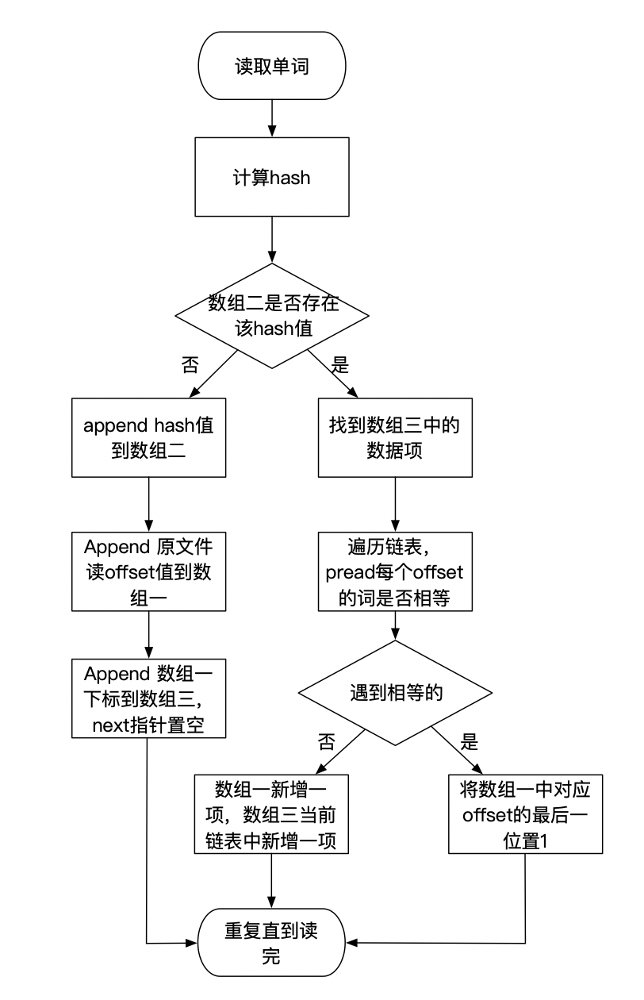

#Requirement
有一个 100GB 的文件，里面内容是文本，要求：
找出第一个不重复的词
只允许扫一遍原文件
尽量少的 IO
内存限制 16G

#设计思路
使用三个数组，都不在内存进行扩容，超过所需内存则创建临时文件。
数组一是每个词的hash值，判断是否重复时先判断是否有对应的hash值，有的话进入第二个数组。
数组二和数组一的数据项一一对应，存链表节点，链表节点的值是数组三的下标。
数组三存原文件的offset。

